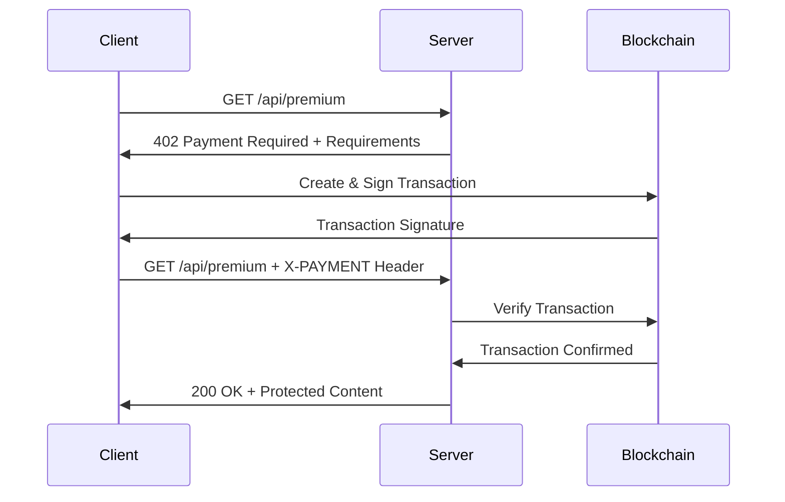

The x402 protocol is an extension of the HTTP 402 Payment Required status code, enabling micropayments for API access using blockchain transactions.

## The x402 Protocol

### HTTP 402 Payment Required

The HTTP 402 status code was reserved for future payment systems. The x402 protocol uses this status code to indicate that payment is required before accessing a resource.

### Payment Flow



## Step-by-Step Flow

### 1. Initial Request

The client makes a request to a payment-protected endpoint:

```typescript
const response = await fetch("http://localhost:4402/api/premium");
```

### 2. Payment Required Response

The server responds with a 402 status code and payment requirements:

```json
{
  "x402Version": 1,
  "accepts": [
    {
      "scheme": "solanaTransferChecked",
      "network": "solana-devnet",
      "maxAmountRequired": "100000",
      "resource": "http://localhost:4402/api/premium",
      "description": "Premium content access",
      "payTo": "FcxKSp...",
      "asset": "EPjFWdd...",
      "maxTimeoutSeconds": 30
    }
  ],
  "error": null
}
```

### 3. Payment Creation

The client creates a Solana SPL token transfer:

```typescript
import { x402 } from "x402test";

const response = await x402("http://localhost:4402/api/premium")
  .withPayment({ amount: "0.10" })
  .execute();
```

Behind the scenes:

- Creates a token transfer instruction
- Signs the transaction with the test wallet
- Submits to the Solana blockchain
- Waits for confirmation

### 4. Request with Payment

The client retries the request with the `X-PAYMENT` header:

```typescript
// Header format (base64 encoded JSON):
{
  "x402Version": 1,
  "scheme": "solanaTransferChecked",
  "network": "solana-devnet",
  "payload": {
    "signature": "5Xz...",
    "from": "FcxK...",
    "amount": "100000",
    "mint": "EPjF...",
    "timestamp": 1699564800000
  }
}
```

### 5. Server Verification

The server verifies the payment:

1. **Decode Header**: Extract payment information
2. **Fetch Transaction**: Get transaction from blockchain
3. **Verify Amount**: Check payment amount matches requirement
4. **Verify Recipient**: Ensure payment went to correct address
5. **Verify Asset**: Confirm correct token (USDC) was used
6. **Check Replay**: Ensure signature hasn't been used before
7. **Mark Used**: Store signature to prevent replay attacks

### 6. Protected Content

If verification succeeds, the server returns the protected content:

```json
{
  "data": "This is premium content!",
  "timestamp": 1699564800000
}
```

## Payment Requirements Schema

### Required Fields

| Field               | Type   | Description                                    |
| ------------------- | ------ | ---------------------------------------------- |
| `scheme`            | string | Payment scheme (e.g., "solanaTransferChecked") |
| `network`           | string | Blockchain network (e.g., "solana-devnet")     |
| `maxAmountRequired` | string | Maximum amount in atomic units                 |
| `resource`          | string | URL of the protected resource                  |
| `payTo`             | string | Recipient wallet address                       |
| `asset`             | string | Token mint address (USDC)                      |

### Optional Fields

| Field               | Type   | Description                |
| ------------------- | ------ | -------------------------- |
| `description`       | string | Human-readable description |
| `mimeType`          | string | Response content type      |
| `maxTimeoutSeconds` | number | Payment timeout in seconds |
| `outputSchema`      | object | Expected response schema   |

## Token Format

The `X-PAYMENT` header contains a base64-encoded JSON payload:

```typescript
interface PaymentPayload {
  x402Version: number;
  scheme: string;
  network: string;
  payload: {
    signature: string; // Transaction signature
    from: string; // Payer address
    amount: string; // Amount in atomic units
    mint: string; // Token mint address
    timestamp: number; // Unix timestamp
  };
}
```

## Security Features

### Replay Attack Protection

x402test tracks used transaction signatures:

```json
// .x402test-signatures.json
[
  {
    "signature": "5Xz...",
    "usedAt": 1699564800000,
    "endpoint": "/api/premium",
    "amount": "100000"
  }
]
```

Once a signature is used, it cannot be reused:

```typescript
// First request succeeds
await x402("http://localhost:4402/api/data").withPayment("0.01").execute();

// Attempting to reuse the same transaction fails
// Server returns 402 with "Payment already processed" error
```

### Amount Verification

The server ensures the paid amount meets requirements:

```typescript
// Server requires 0.10 USDC
const requirements = {
  maxAmountRequired: "100000", // 0.10 USDC in atomic units
};

// Client pays 0.05 USDC - REJECTED
await x402(url).withPayment("0.05").execute(); // Error!

// Client pays 0.10 USDC or more - ACCEPTED
await x402(url).withPayment("0.10").execute(); // Success!
```

### Recipient Verification

Payments must go to the specified recipient:

```typescript
// Transaction must transfer to correct address
const verification = await verifyPayment(
  signature,
  expectedRecipient, // Must match payment requirement
  expectedAmount,
  expectedMint
);
```

## Atomic Units

USDC uses 6 decimal places. Amounts are specified in atomic units:

| USDC  | Atomic Units |
| ----- | ------------ |
| 0.01  | 10,000       |
| 0.10  | 100,000      |
| 1.00  | 1,000,000    |
| 10.00 | 10,000,000   |

```typescript
// Helper function
const toAtomicUnits = (usdc: string): string => {
  return (parseFloat(usdc) * 1e6).toString();
};

toAtomicUnits("0.10"); // "100000"
```

## Error Handling

### Common Error Scenarios

#### Insufficient Payment

```typescript
{
  "x402Version": 1,
  "accepts": [...],
  "error": "Payment amount 50000 is less than required 100000"
}
```

#### Invalid Signature

```typescript
{
  "error": "Transaction not found or not confirmed"
}
```

#### Replay Attack

```typescript
{
  "error": "Payment already processed"
}
```

#### Wrong Recipient

```typescript
{
  "error": "Wrong recipient: expected FcxK..., got EPjF..."
}
```

## Next Steps

- [Payment Flow](/payment-flow) - Detailed payment process
- [Testing Client](/testing-client) - Using the x402 client
- [Mock Server](/mock-server) - Setting up the test server
- [API Reference](/api/client) - Complete API documentation
